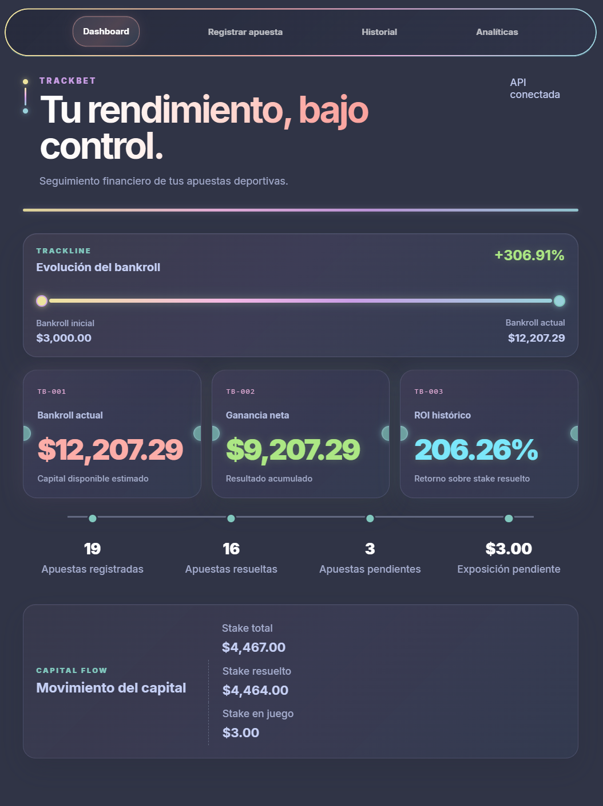
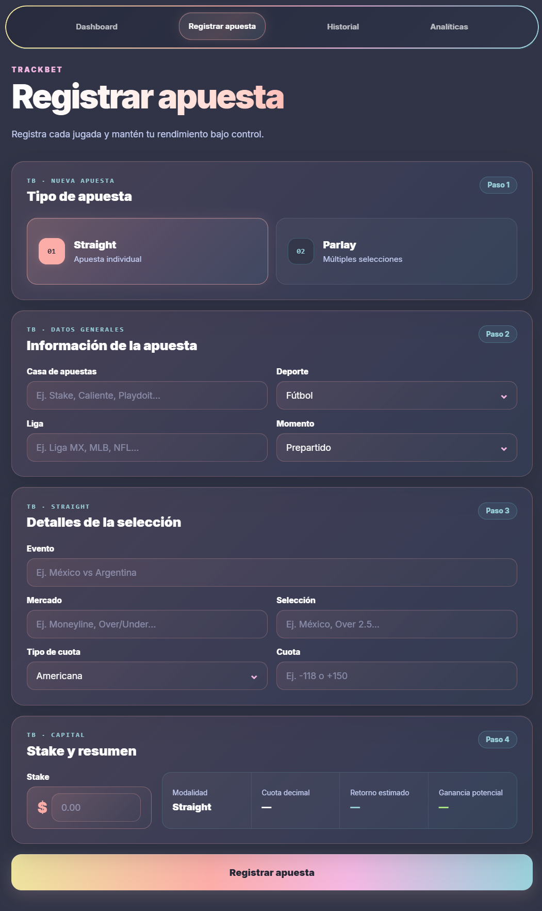
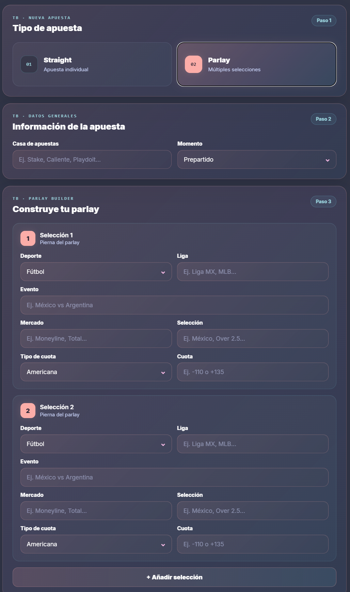
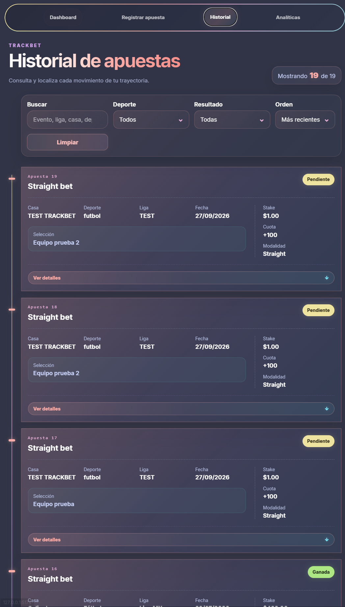
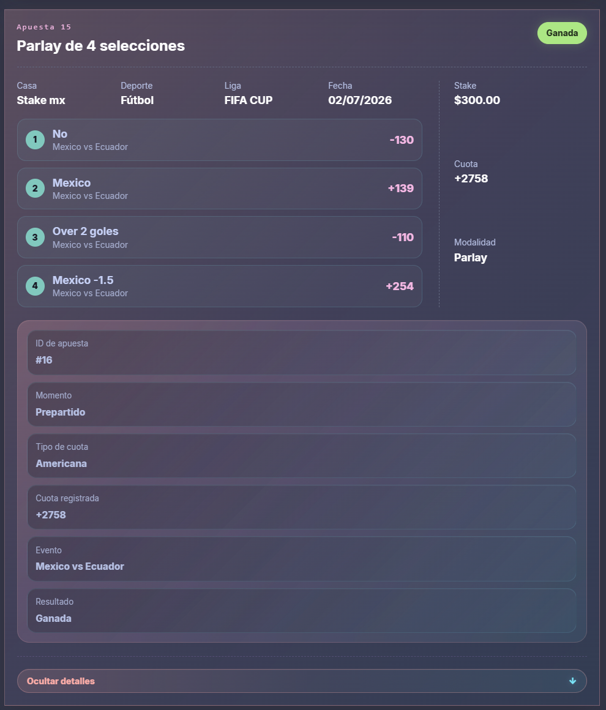

# TrackBet Desktop

> 🚧 **Estado: En desarrollo activo**

TrackBet Desktop es una aplicación para registrar, consultar y analizar apuestas deportivas de forma local.

El proyecto está construido con **React**, **FastAPI** y **SQLite**, con el objetivo de convertirse en una aplicación instalable para Windows que funcione de manera local y sin depender de servicios externos para almacenar la información.

---

## Descripción general

TrackBet nace como una alternativa más estructurada a llevar el control de apuestas deportivas mediante hojas de cálculo.

La aplicación permite centralizar el historial de apuestas, el seguimiento del bankroll, el rendimiento acumulado y las métricas principales de una estrategia de betting dentro de una misma interfaz.

Actualmente el proyecto se encuentra en desarrollo activo y ya cuenta con un flujo funcional entre:

```text
React
  ↓
FastAPI
  ↓
SQLite
```

### Tecnologías utilizadas

- React
- JavaScript
- Vite
- Python
- FastAPI
- Pydantic
- SQLite
  Próximamente
- Tauri
- Empaquetado para Windows
- Instalador de TrackBet Desktop

## Funcionalidades actuales











### Dashboard

- Seguimiento del bankroll
- Bankroll inicial y actual
- Ganancia neta
- ROI histórico
- Apuestas registradas
- Apuestas resueltas
- Apuestas pendientes
- Exposición pendiente
- Evolución visual del bankroll
  Registro de apuestas
- Registro de apuestas Straight
- Registro de apuestas Parlay
- Constructor dinámico de Parlays
- Múltiples selecciones por Parlay
- Deportes y ligas independientes por selección
- Cuotas americanas
- Cuotas decimales
- Apuestas prepartido y en vivo
- Registro de stake
- Cálculo automático de cuota decimal
- Cálculo de retorno estimado
- Cálculo de ganancia potencial
- Validación de formularios
- Integración React → FastAPI → SQLite
  Historial de apuestas
- Historial completo de apuestas
- Visualización de apuestas Straight y Parlay
- Búsqueda
- Filtro por deporte
- Filtro por resultado
- Orden por fecha
- Orden por stake
- Paginación
- Detalles expandibles
- Visualización de selecciones individuales en Parlays
- Estados Ganada, Perdida, Pendiente y Push
- Diseño responsive
  Backend
- API REST construida con FastAPI
- Validación de datos con Pydantic
- Persistencia local con SQLite
- Cálculos de apuestas
- Conversión de cuotas
- Cálculos de bankroll
- Cálculo de ROI
- Lógica de Parlays
- Manejo de Push
- Liquidaciones
- Diagnóstico del sistema
- Generación de respaldos
- Exportación de reportes
- Utilidades CSV

## Arquitectura actual

```text
┌──────────────────────────┐
│      React + Vite        │
│      Interfaz web        │
└────────────┬─────────────┘
             │
             │ HTTP / JSON
             ▼
┌──────────────────────────┐
│        FastAPI           │
│ API + lógica de negocio  │
└────────────┬─────────────┘
             │
             ▼
┌──────────────────────────┐
│         SQLite           │
│   Almacenamiento local   │
└──────────────────────────┘
```

## Arquitectura prevista para TrackBet Desktop

El objetivo para la versión Desktop v1 es mantener la arquitectura actual y empaquetarla como aplicación de Windows.

```text
┌───────────────────────────────┐
│      TrackBet Desktop         │
│            Tauri              │
├───────────────────────────────┤
│          React UI             │
├───────────────────────────────┤
│    FastAPI local service      │
├───────────────────────────────┤
│          SQLite               │
└───────────────────────────────┘
```

La intención es que la aplicación pueda funcionar localmente sin requerir una conexión permanente a Internet.

---

## Estado actual del desarrollo

### Completado

- [x] Interfaz React
- [x] Backend FastAPI
- [x] Persistencia SQLite
- [x] Dashboard
- [x] Historial
- [x] Filtros y búsqueda
- [x] Registro Straight
- [x] Parlay Builder
- [x] Cálculos de stake y retorno
- [x] Integración React → FastAPI → SQLite
- [x] Diseño responsive
- [x] Manejo básico de errores
- [x] Lint del frontend sin errores

### En desarrollo

- [ ] Validación end-to-end completa de Parlays
- [ ] Edición de apuestas desde React
- [ ] Liquidación de apuestas
- [ ] Eliminación de apuestas
- [ ] Actualización automática del Dashboard
- [ ] Exportación CSV desde la interfaz
- [ ] Interfaz de respaldo
- [ ] Restauración de respaldos
- [ ] Estados vacíos
- [ ] Datos de demostración opcionales
- [ ] Pruebas API adicionales
- [ ] Empaquetado con Tauri
- [ ] Instalador para Windows

### Objetivos de TrackBet Desktop v1

La primera versión estable de TrackBet Desktop tiene como objetivo incluir:

- Registro de apuestas Straight y Parlay
- Historial completo
- Filtros y búsqueda
- Edición de apuestas
- Liquidación de apuestas
- Eliminación de apuestas
- Ganancias y pérdidas
- ROI
- Win rate
- Seguimiento del bankroll
- Exportación CSV
- Copias de seguridad
- Restauración de datos
- SQLite local
- Manejo claro de errores
- Estados vacíos
- Datos de demostración opcionales
- Instalador para Windows

### Fuera del alcance de la versión 1

Para mantener el desarrollo enfocado, las siguientes funciones no forman parte actualmente de TrackBet Desktop v1:

- Aplicaciones para iOS
- Aplicaciones para Android
- Cuentas de usuario
- Sincronización en la nube
- Pagos
- Suscripciones
- Cuotas deportivas en vivo
- Integraciones con casas de apuestas
- Integraciones comerciales externas

### Estado del proyecto

TrackBet Desktop todavía no se considera una versión final de producción.
Este repositorio representa un proyecto en desarrollo activo y se publica para documentar:

- La arquitectura
- El progreso del desarrollo
- La implementación
- Las pruebas
- La evolución hacia una versión instalable para Windows

### Ejecutar el proyecto

Actualmente el entorno de desarrollo requiere:

- Python
- Node.js
- npm

### Backend

Desde la carpeta raíz del proyecto:
python -m uvicorn api_trackbet:app --reload --host 127.0.0.1 --port 8000
La API estará disponible en:
<http://127.0.0.1:8000>

### Frontend

## Desde la carpeta frontend

npm install
npm run dev

### El objetivo durante el desarrollo es mantener

0 warnings
0 errors

## Pruebas del backend

### Las pruebas del backend cubren progresivamente

- Cálculos
- Cuotas
- Parlays
- Bankroll
- ROI
- Almacenamiento
- API

### Roadmap

Fase 1 — Núcleo

- [x] React
- [x] FastAPI
- [x] SQLite
- [x] Dashboard
- [x] Historial
- [x] Registro Straight
- [x] Parlay Builder
      Fase 2 — CRUD
- [ ] Editar apuestas
- [ ] Liquidar apuestas
- [ ] Eliminar apuestas
      Fase 3 — Utilidades
- [ ] Exportación CSV
- [ ] Backup
- [ ] Restore
- [ ] Datos demo
      Fase 4 — Desktop
- [ ] Tauri
- [ ] FastAPI como servicio local
- [ ] SQLite en directorio del usuario
- [ ] Build de producción
- [ ] Instalador para Windows
      Fase 5 — Release
- [ ] TrackBet Desktop v1.0.0
- [ ] Capturas finales
- [ ] GIF o video demo
- [ ] GitHub Release
- [ ] Instalador descargable

### Autor

Desarrollado por Wasatnight.

```text

```
